This post presents my approach to addressing the challenges of large-scale log queries in Loki, detailing the development, iteration, and implementation of the BBF index.

# Background

Loki is Grafana's open-source log aggregation system, designed with an "index-free" philosophy. This means it only indexes metadata (labels) of logs lightly, while storing log content directly without any indexing. This design offers several advantages:

<!-- more -->

- **Lightweight Log Ingestion:** Since no index is built for log content, log ingestion is very fast, with low resource usage. Typically, it can achieve speeds of up to 25MB/s per core.
- **Smaller Storage Footprint:** There's no need to store massive indexes, unlike systems with inverted indexes where the index size can be as large as the log data itself.
- **Cost Shifting from Ingestion to Querying:** Given that logs are written more frequently than they are read, this design allows for rapid log ingestion with minimal resources. Then, by deploying a large querying cluster, it leverages the high throughput of object storage (up to tens of GB/s) for brute-force downloading and searching.

# The Problem

Loki organizes data by labels, storing logs with the same label values in the same set of files. This means that when querying with specific application labels, data from other applications is excluded. This approach is cost-effective when the total log volume is large but each application's log volume is relatively balanced, potentially reducing costs to 20% of what Elasticsearch (ES) would require.

However, when an application's log volume reaches the terabyte scale, Loki struggles with queries, especially for "needle-in-a-haystack" searches, such as finding a specific `tid` or `requestId` in tens of terabytes of logs. In contrast, traditional systems with inverted indexes typically handle such queries in less than a second.

# The Journey to a Solution

The Loki community has raised similar concerns, and the Loki team has been contemplating solutions. However, after deploying Loki in 2022, we urgently needed to address this issue. Our exploration can be summarized in three stages:

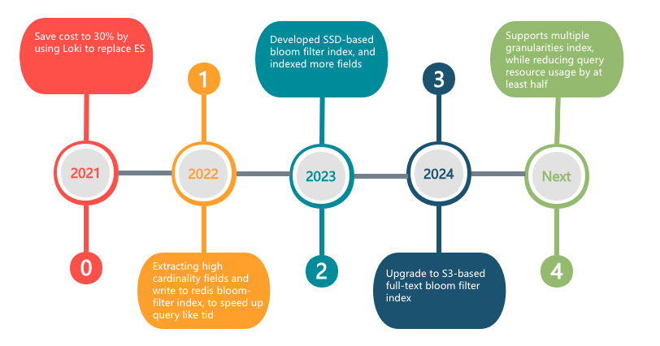

1. **Stage 1:** Extracting high-cardinality fields like `tid` and writing them to a Redis Bloom filter.
2. **Stage 2:** Developing a Bloom filter index based on SSD storage (BBF 1.0), indexing more commonly queried fields.
3. **Stage 3:** Designing and developing a large-scale full-text Bloom filter index based on S3 (BBF 2.0).

# Stage 1: Redis-Based Bloom Filter Index

When thinking about how to accelerate queries for high-cardinality fields like `tid`, the most straightforward approach is to reduce unnecessary data retrieval. However, we couldn't use inverted indexes, as that would revert to the old system's approach, negating Loki's advantages.

To achieve something lighter than an inverted index, I naturally thought of Bloom filters. In the second half of 2022, I enhanced Loki's ingestion and querying paths to use Redis Bloom filters to accelerate queries. The core idea was to create a Bloom filter for each 10-minute time slice and write the field values that needed indexing during that period. During queries, the Bloom filter would filter out time slices that didn't contain the query keyword, narrowing the search scope.

```
A Bloom filter is a probabilistic data structure with a certain false-positive rate. When it returns "exists," the value might not actually exist, but when it returns "does not exist," the value definitely doesn't exist. This allows us to filter out data that doesn't contain the query keyword.
```


## Write Path

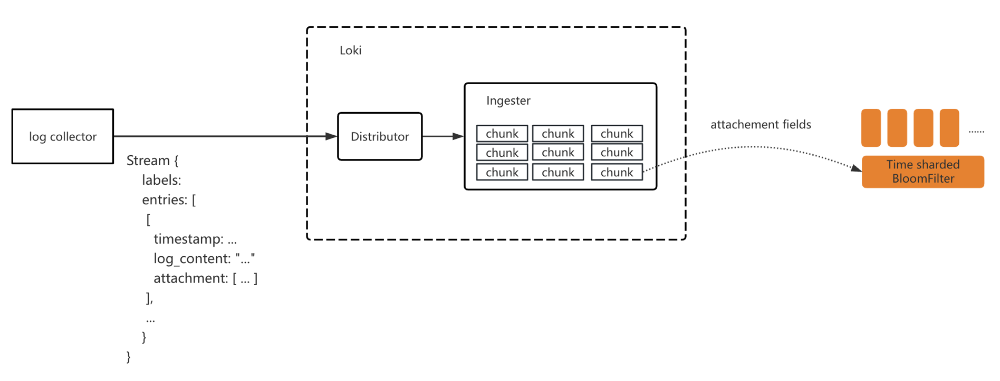

The ingestion path modifications included:

1. Extending Loki's ingestion protocol to extract relevant fields from log content and write them as attachments to Loki.
2. Modifying Loki's ingestion pipeline to batch-write attachment fields into Bloom filters.

We created a Bloom filter for each application every 10 minutes, with the filter name formatted as `${tenantId}_${app}_202503041910`.

## Query Path

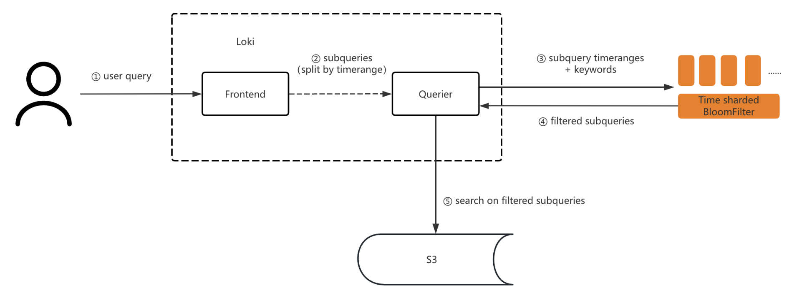

During queries, we first checked the Bloom filter based on the field and time to filter out time slices that didn't contain the corresponding value, thereby reducing the search scope. For example, if the query's end time was rounded to "202503041910," we used the query keyword to filter the Bloom filter named `${tenant}_${app}_202503041910`. If the keyword didn't exist in the filter, the subquery didn't need to be executed. If it returned "exists," we pulled the log file data for searching.

## Fault Tolerance

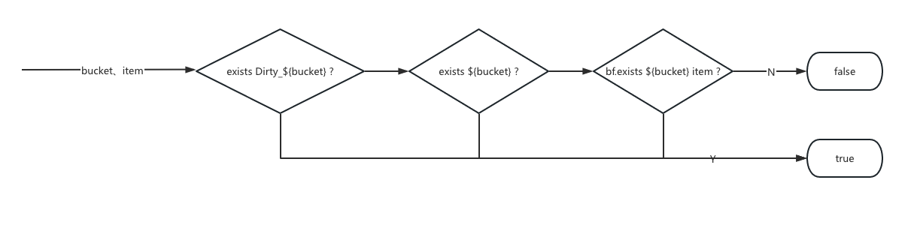

1. If an exception occurred during attachment ingestion, we marked the Bloom filter shard as dirty in Redis, e.g., `Dirty_myapp_2769901`.
2. During queries, if this mark was found, we downgraded to a full-text search.

After this version was deployed, we iterated further by optimizing the time-slice granularity of the Bloom filter to a file ID granularity. During ingestion, we still created Bloom filters for time slices, but when writing field values, we appended the log file ID (called `chunkId` in Loki) to each value. The final key written was: 

```
key + "_" + chunkId
```

During queries, we also appended `chunkId` to filter, reducing the filtered data volume from time slices to just a few chunk files.

## Results

After the first stage of optimization, querying for a `tid` in 20TB of logs was reduced from several minutes to under 3 seconds, with the search data volume reduced to a few hundred MB.


# Stage 2: SSD-Based Bloom Filter Index

The Redis Bloom filter index achieved query performance close to full-text indexing, satisfying common query scenarios. However, Redis's high cost made it impractical to index more fields due to resource constraints.

I then considered whether Bloom filters could be stored on disk. Inspired by a paper[1], I designed an SSD-based Bloom filter index, called BBF 1.0, tailored to our scenario.

## Core Principles

SSDs are one to two orders of magnitude slower than memory in I/O speed. However, since Bloom filter writes and queries have explicit keys without prefix or suffix reads, we could design the Bloom filter to be stored in multiple shards:

- **Ingestion:** A hash function maps the key to a specific shard, which is buffered in memory and periodically flushed to SSD.
- **Querying:** The hash function locates the key's specific shard, which is then loaded from SSD.

This sharding mechanism effectively reduces the data volume read from SSD during queries. By batching writes and briefly caching reads, the increased latency is imperceptible to users.

## Write Path

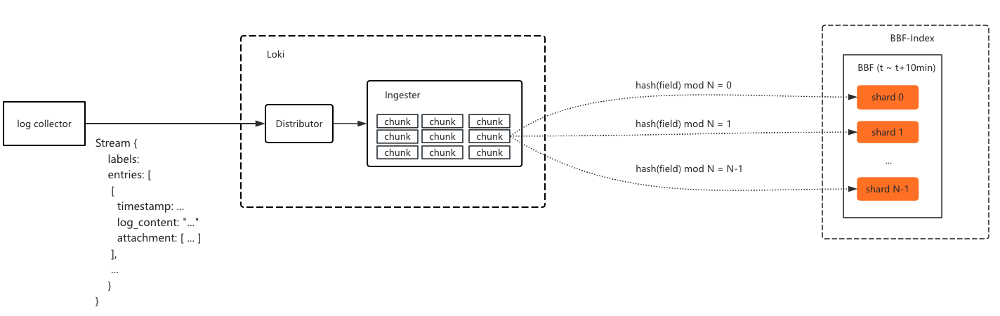

When a log chunk is flushed to storage, all indexed field values in the chunk are batch-written to their corresponding Bloom filters. During write, a hash function maps the field value to a specific shard, which is then written to.

## Query Path

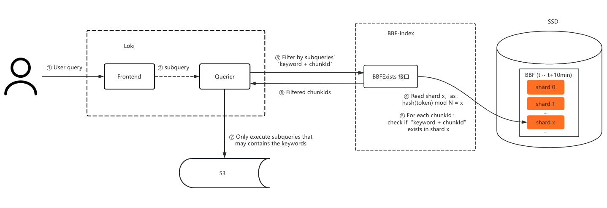

During queries, the key's hash value locates the shard, which is loaded from SSD into memory. The key is then concatenated with each `chunkId` and filtered through the shard to determine if the chunk might contain the key. If not, the chunk file doesn't need to be queried.

## Storage Structure

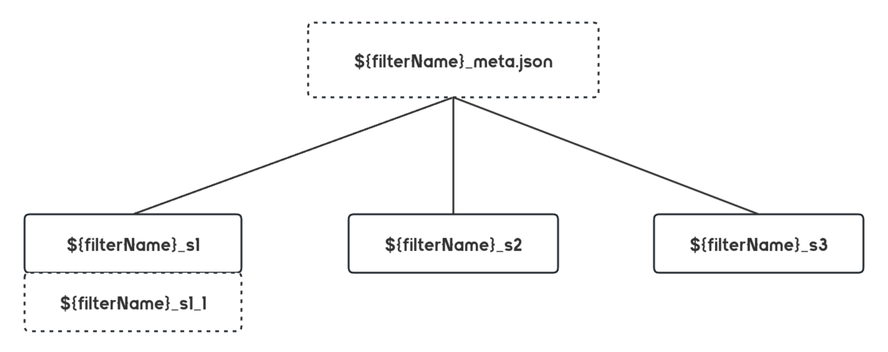

- **Structure:** Each Bloom filter consists of a meta and multiple "sub-filters."
- **Storage:** The meta is cached in memory, recording shard count and other metadata, while sub-filters are stored in SSD files as Bloom filter bit arrays.
- **Ingestion:** The first hash function maps the field value to a specific sub-filter.
- **Querying:** The field value's sub-filter is located and loaded from SSD for filtering.

## Filter Expansion

If too many keys are written to a Bloom filter, its false-positive rate increases. Therefore, when the number of written values exceeds a preset threshold, the filter expands by creating new sub-filters with suffixes. For example, if the filter name is `202308090110_fake_tid_myapp`, and the key's hash maps to shard 1, a new filter of the same size is created when the key count exceeds the capacity. The key's sub-filter file list would then be:

```
202308090110_fake_tid_myapp_s1
202308090110_fake_tid_myapp_s1_1
```


## Directory Structure

By default, the filter name is used as the storage file name, with "default" as the directory name. If a prefix is provided, it is used as the directory name. The directory tree looks like this:

```
./202308111210
202308111210_fake_tid_myapp_meta.json
202308111210_fake_tid_myapp_s0
202308111210_fake_tid_myapp_s0_1
202308111210_fake_tid_myapp_s1
202308111210_fake_tid_myapp_s1_1
...
202308111210_fake_tid_myapp_s3000
202308111210_fake_tid_myapp_s3000_1
```


## Data Ingestion and Flushing

During ingestion, Bloom filters are first built in memory and then flushed to SSD after a period. If new data needs to be written, it is buffered in memory and periodically updated. The timeline is as follows:

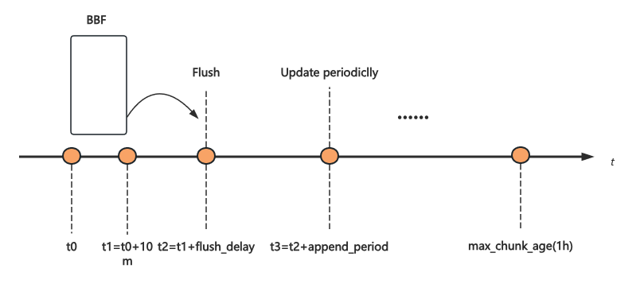

- **t0-t1:** BBF is created for each 10-minute window, with all data in this period written to the same BBF index (which contains many shards).
- **t2:** After the 10-minute window, the BBF is flushed to SSD after a delay (`flush_delay`).
- **t3:** If new data is written after the BBF is flushed, it is buffered in memory for a period (`append_period`) before being batch-appended to the BBF to avoid repeated loading and flushing.
- **max_chunk_age:** This is the maximum time a log chunk is cached in Loki's Ingester. Chunks older than this are immediately flushed, so the BBF index may be appended multiple times within the `max_chunk_age` span.

## Performance Analysis

For a data center querying `tid`, with about 4.4 billion enumerations per day and a false-positive rate of 0.001, the Bloom filter size is approximately 7.5GB[3]. Assuming 100 shards and 10 queries per SSD I/O, the SSD file size to read is:

```
7.5GB / 100 / 10 = 7.5MB
```

With an SSD read speed of 250MB/s, a query takes about 30ms. Increasing the shard count can further reduce the data volume loaded per query.

Cluster management and fault tolerance are not detailed here, as they follow similar practices.

## Results

After deploying BBF 1.0, we supported 50 times the index capacity at the same cost, with query latency indistinguishable from Redis.

# Stage 3: S3-Based Bloom Filter Index

While BBF 1.0 supported more fields, scaling to full-text Bloom filters posed challenges:

- **SSD Bandwidth Limitation:** In full-text scenarios, the Bloom filter size is about 3% of the original log volume. For 20TB of logs, this is 600GB. With 3000 shards and 10 keys per query, the data volume to load is: 600GB / 3000 * 10 ≈ 18GB. With an SSD bandwidth of 250MB/s, the read time is 72 seconds.

- **Ingester Memory Issue:** In BBF 1.0, extracted fields were cached in Ingester memory until the log chunk was flushed to storage. In full-text scenarios, caching all keys in memory is too expensive.

- **Cross-Zone Traffic:** Since our ingestion pipeline is multi-zone isolated, writing all keys from a log chunk to different BBF nodes would incur significant cross-zone traffic, which is costly with some cloud providers.

Additionally, to meet high performance and scalability requirements, we had to consider:

- **Tokenization Task Coordination:** How multiple nodes divide tokenization tasks.
- **Index Shard Management Coordination:** How nodes manage shards, particularly deciding which node is responsible for which shard's write buffer.

## Community Solution

Coincidentally, the Loki team was also developing a Bloom filter-based index.

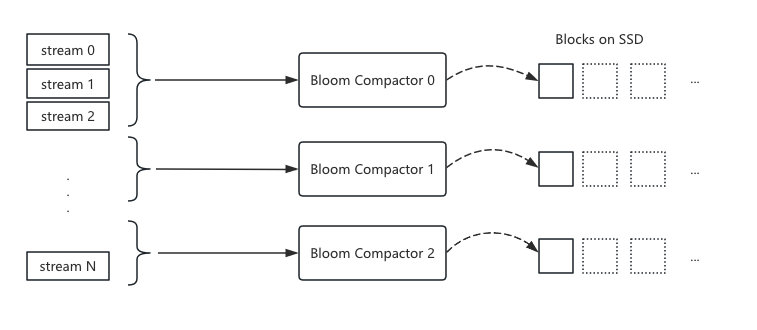

 Their approach involved adding Bloom compactor nodes, where multiple compactor nodes divide tasks by stream segments, with each node responsible for indexing logs in its segment. The index is built into blocks stored on SSD.

```
A stream is a unique combination of multiple labels. Loki organizes log ingestion by stream, e.g., with 3 labels and 100 value combinations, there would be 100 streams.
```

The community version only parallelized data processing tasks, with data storage being a simple accumulation. It didn't optimize query data volume reduction, requiring many SSDs to improve throughput. This approach becomes cost-prohibitive at scale.

## Community's Shortcomings

After testing, the community found their solution difficult to scale, so they modified their approach to extract high-cardinality fields into structured metadata and then index them. This is similar to our Stage 2 solution.

The community's approach has the following shortcomings:

- **High Resource Consumption:** Loki documents state that index building processes about 4MB of data per core per second. For a 1GB/s cluster, at least 256 cores are needed, with more required during peak times.
- **High Index Latency:** Building indexes by cycling through streams can result in significant delays, as the time to build a new log index equals the time to process all streams.
- **Poor Query Performance:** Without optimizing data storage structure, each query may load all Bloom data, limiting indexing to partial fields.

## Our Solution

In the first half of 2024, I tested the community's solution and modified its storage structure to optimize query speed by hash-sharding the blocks, similar to our Stage 2 approach. After six months of testing, query speed was acceptable, but index ingestion was slow, with delays exceeding an hour under reasonable resource constraints. We abandoned the community's approach and returned to our design.

### Architecture

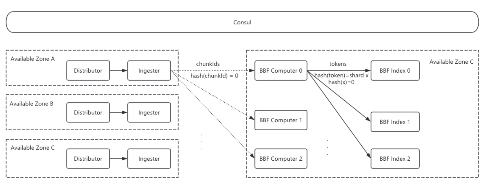

- **Ingester:** When flushing log chunks to storage, the Ingester also sends the `chunkId` to BBF Computer nodes. This incurs some cross-zone traffic, but since only file IDs are sent, the traffic is minimal.
- **BBF Computer Nodes:** These nodes handle tokenization tasks. Upon receiving a `chunkId`, they pull the log file from S3, tokenize it, and send the tokens to the corresponding BBF Index nodes based on hash mapping.
- **BBF Index Nodes:** These nodes buffer and store Bloom filter shards. Each node's shard responsibility is determined by Consul cluster discovery and hash calculation.

### Cluster Management

Cluster management primarily addresses BBF Index cluster scaling. Since Bloom filter shards are buffered in BBF Index memory, scaling the cluster changes hash mappings, potentially causing a shard to exist on two nodes. When scaling down, although data is written to S3, node count changes can disrupt shard management.

**Sticky Ring Solution**

After creating all BBF shards, the node list for the current time bucket is recorded in Consul. When scaling up, new nodes only handle BBFs created for the next time bucket. When scaling down, nodes are first decommissioned, stopping new shard creation but completing writes for current shards until the maximum time window is exceeded.

### Memory Control and Stability

Our index is split by time buckets (e.g., 10 minutes per BBF). Ideally, active indexes should be concentrated in the last one or two buckets, but in practice, ingestion backlogs or Ingester flush disorder like below, which can cause memory bucket counts to grow significantly, requiring resource scaling to catch up.

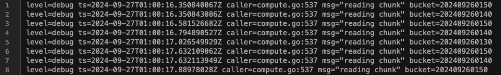

**Distributed Window Mechanism:** To control BBF bucket length, we implemented a window mechanism. However, during testing, we found that different nodes had different window elements, severely reducing ingestion speed. We upgraded to a Consul-based distributed window, where Consul stores keys like:

```
# With one element
./window/202503030240/prod-bbf-index-c-1
./window/202503030240/prod-bbf-index-c-2
./window/202503030240/prod-bbf-index-c-3
./window/202503030240/prod-bbf-index-c-4

# With multiple elements in the candidate queue
./candidate/202503030250
./candidate/202503030310
```

- **When expanding the window**: each BBF Index node creates a bucket key under `/window` containing its hostname. 

- **When shrinking the window**: a node only deletes its bucket key. The bucket is deleted only when all nodes have removed their keys, as shown below:

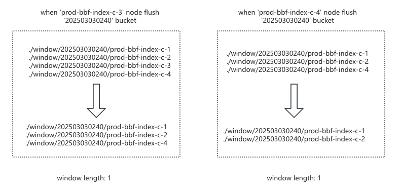

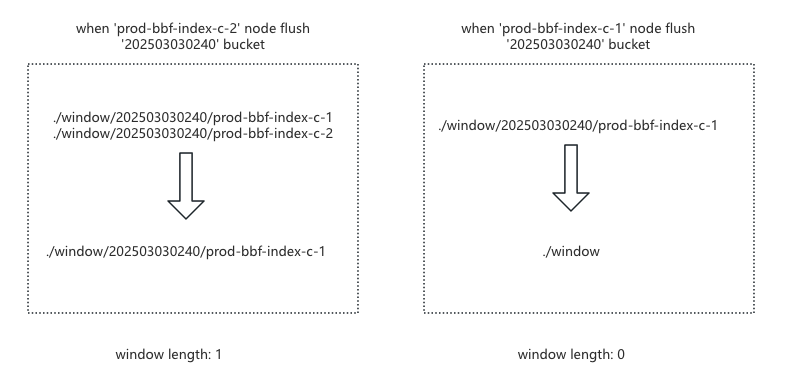

After resolving bucket length and multi-node window inconsistency issues, we found that during ingestion backlogs, older shards could starve for window space. We added a candidate queue, sorting it on each change and moving the smallest bucket element into the window when space is available, resolving starvation.

**Rectification:** Despite the window and candidate mechanisms, severe bucket disorder could cause delays due to minimum buffer times. To improve ingestion speed during backlogs, we rectified `chunkId` ingestion by batch-reading `chunkIds`, grouping them by bucket, sorting, and ingesting in bucket order, significantly improving ingestion speed.

## Summary

This solution:

- Reduces cross-zone traffic by having Ingester only send `chunkId` to Bloom Computer nodes.
- Resolves Ingester memory issues by having Computer nodes pull chunks from S3 for computation (S3 Get is cheap).
- Separates compute-intensive BBF Computer nodes from memory-intensive BBF Index nodes, minimizing query impact from ingestion.
- Coordinates tokenization and index ingestion tasks while retaining Stage 2's data volume reduction optimizations.
- Introduces sticky ring for cluster management.
- Implements a distributed window mechanism for index ingestion memory control.
- Uses rectification to improve ingestion speed during backlogs.

## Results

After deployment, this solution supported full-text Bloom indexing with 1/5 the resources of the community version, increasing index capacity by 30 times over Stage 2. Ingestion latency dropped from about an hour in the community version to seconds. Query data volume was thousands of times smaller than the community's, with query times similar to Stage 2:

- **400-core querier + 32GB index nodes:** Querying different frequency data from 20TB took about 3 seconds P95; querying 7 days of 140TB data took about 12 seconds P95.
- **200-core querier + 32GB index nodes:** Querying low-frequency keywords took similar times to 400 cores; querying high and medium-frequency keywords took about twice as long, indicating potential for further optimization.

# Conclusion and Outlook

After three years and three major iterations, we achieved a lightweight Bloom filter index for full-text tokenization, solving Loki's query performance issues at scale. Our solution shares some ideas with the community's but takes a different path.

The bottleneck lies in index nodes, and increasing resources can further improve query performance. Potential optimizations include:

- Vectorized computation to speed up index node judgment.
- Automatic degradation for high-frequency tokens.
- Configurable multi-granularity Bloom filters, e.g., time slices and `chunkId`.

---

[1] Loki Cloud maintains a 50TB Memcached cluster to meet cloud customers' query performance requirements: https://grafana.com/blog/2023/08/23/how-we-scaled-grafana-cloud-logs-memcached-cluster-to-50tb-and-improved-reliability/
[2] Buffered Bloom Filters on Solid State Storage, https://citeseerx.ist.psu.edu/document?repid=rep1&type=pdf&doi=da6a07944d97723d6c154d76609b5c20a3636f9a
[3] Bloom filter calculator: https://hur.st/bloomfilter/


